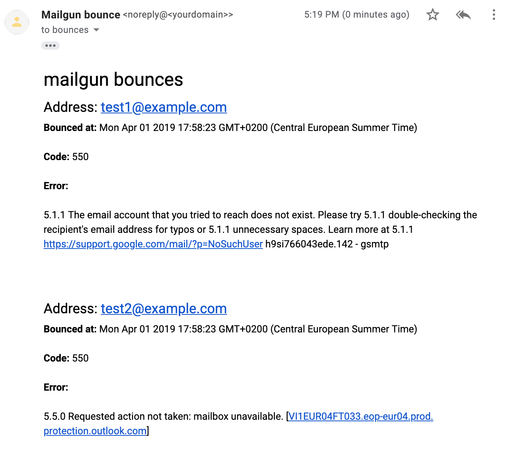

# Mailgun.js Suppression Notifications Proof of Concept

A proof of concept script to send a summary email of all bounced suppressions.



## Usage

Clone the repo, `npm install` and run like this on the command line:

```sh
node index.js <API Key> <domain>
```

If running for an EU domain, pass a 1 as the last argument:

```sh
node index.js <API Key> <domain> 1
```

The script will send a summary to `bounces@<domain>` (sent from `noreply@<domain>`). It will not remove any suppressions from the list.
